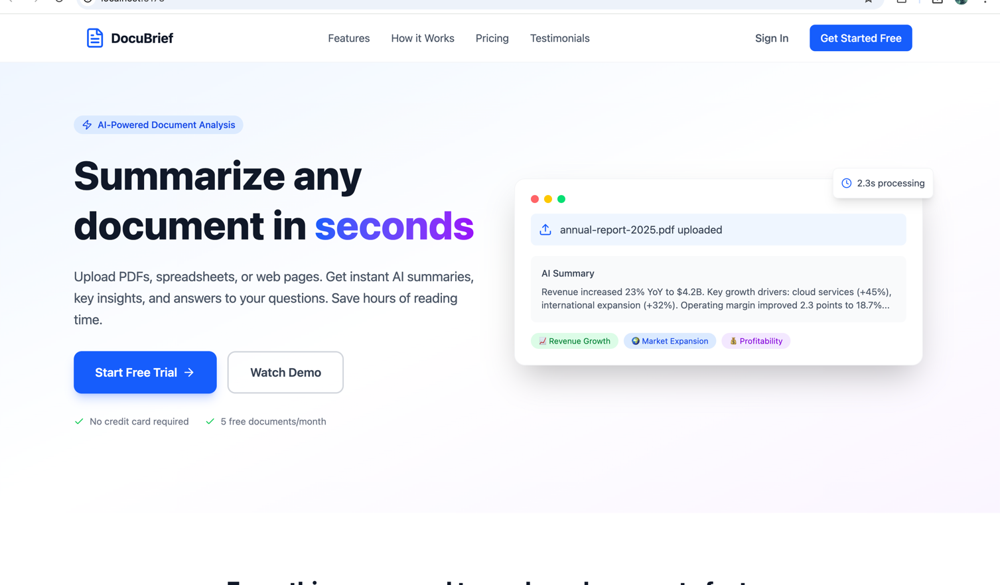
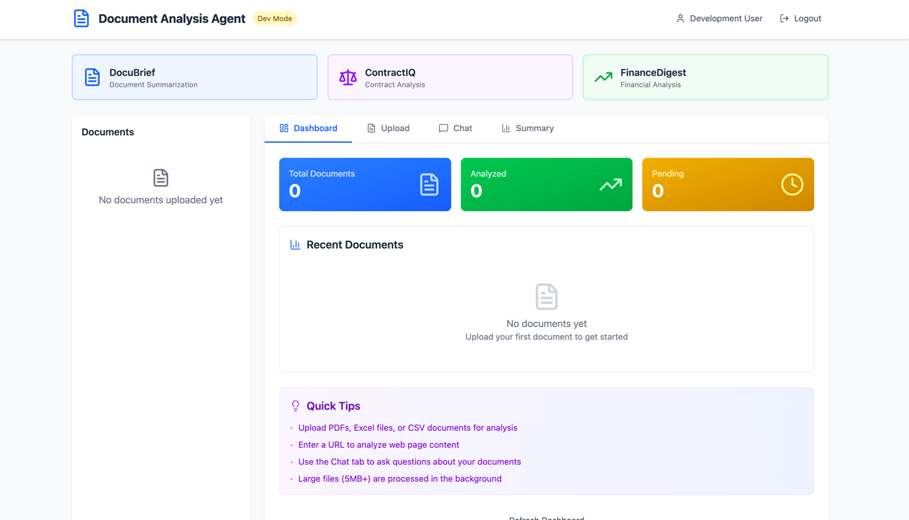
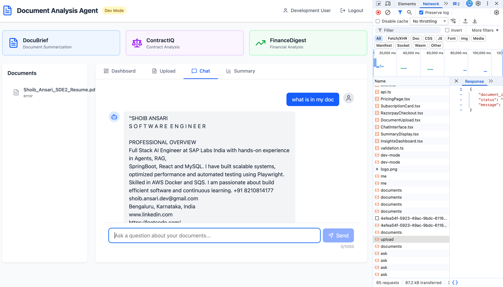

# AI-Powered Document Analysis Agent

An intelligent document analysis system that automatically summarizes PDFs, spreadsheets, and web pages, delivering quick, context-aware insights.

## Features

- 📄 **PDF Analysis** - Extract and summarize content from PDF documents
- 📊 **Spreadsheet Processing** - Analyze Excel and CSV files
- 🌐 **Web Page Analysis** - Fetch and summarize content from URLs
- 💬 **Q&A Interface** - Ask questions about your documents
- 🔍 **Context-Aware Insights** - RAG-powered intelligent analysis

## Tech Stack

- **Backend:** Python, FastAPI
- **AI/LLM:** xAI Grok API
- **Frontend:** React, TypeScript, Tailwind CSS
- **Vector Store:** ChromaDB

# Landing Page

# DocuBrief Landing

# DocuBrief Working

---

*This is a VibeCode application that demonstrates the full power of AI to orchestrate intelligent document analysis.*